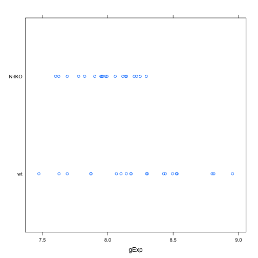
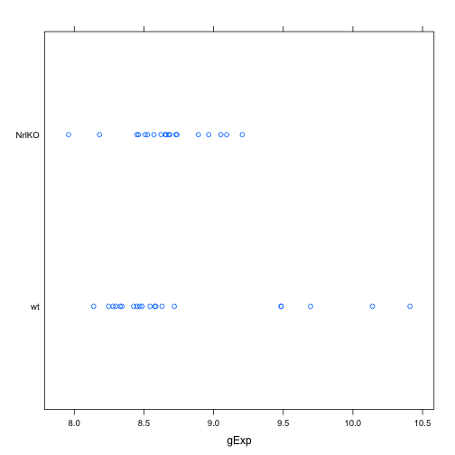

Seminar 4
============================

Part 1 Following the example code:
_____________________________________

```r
library(lattice)
prDat <- read.table("GSE4051_data.tsv")
str(prDat, max.level = 0)
```

```
## 'data.frame':	29949 obs. of  39 variables:
```

```r
prDes <- readRDS("GSE4051_design.rds")
str(prDes)
```

```
## 'data.frame':	39 obs. of  4 variables:
##  $ sidChar : chr  "Sample_20" "Sample_21" "Sample_22" "Sample_23" ...
##  $ sidNum  : num  20 21 22 23 16 17 6 24 25 26 ...
##  $ devStage: Factor w/ 5 levels "E16","P2","P6",..: 1 1 1 1 1 1 1 2 2 2 ...
##  $ gType   : Factor w/ 2 levels "wt","NrlKO": 1 1 1 1 2 2 2 1 1 1 ...
```

```r
set.seed(987)
(theGene <- sample(1:nrow(prDat), 1))
```

```
## [1] 14294
```

```r
pDat <- data.frame(prDes, gExp = unlist(prDat[theGene, ]))
str(pDat)
```

```
## 'data.frame':	39 obs. of  5 variables:
##  $ sidChar : chr  "Sample_20" "Sample_21" "Sample_22" "Sample_23" ...
##  $ sidNum  : num  20 21 22 23 16 17 6 24 25 26 ...
##  $ devStage: Factor w/ 5 levels "E16","P2","P6",..: 1 1 1 1 1 1 1 2 2 2 ...
##  $ gType   : Factor w/ 2 levels "wt","NrlKO": 1 1 1 1 2 2 2 1 1 1 ...
##  $ gExp    : num  9.88 10.59 10.28 10.22 8.75 ...
```

```r
aggregate(gExp ~ gType, pDat, FUN = mean)
```

```
##   gType  gExp
## 1    wt 9.758
## 2 NrlKO 9.553
```

```r
stripplot(gType ~ gExp, pDat)
```

 

```r
t.test(gExp ~ gType, pDat)
```

```
## 
## 	Welch Two Sample t-test
## 
## data:  gExp by gType
## t = 1.479, df = 36.78, p-value = 0.1475
## alternative hypothesis: true difference in means is not equal to 0
## 95 percent confidence interval:
##  -0.07586  0.48605
## sample estimates:
##    mean in group wt mean in group NrlKO 
##               9.758               9.553
```

```r
ttRes <- t.test(gExp ~ gType, pDat)
str(ttRes)
```

```
## List of 9
##  $ statistic  : Named num 1.48
##   ..- attr(*, "names")= chr "t"
##  $ parameter  : Named num 36.8
##   ..- attr(*, "names")= chr "df"
##  $ p.value    : num 0.148
##  $ conf.int   : atomic [1:2] -0.0759 0.4861
##   ..- attr(*, "conf.level")= num 0.95
##  $ estimate   : Named num [1:2] 9.76 9.55
##   ..- attr(*, "names")= chr [1:2] "mean in group wt" "mean in group NrlKO"
##  $ null.value : Named num 0
##   ..- attr(*, "names")= chr "difference in means"
##  $ alternative: chr "two.sided"
##  $ method     : chr "Welch Two Sample t-test"
##  $ data.name  : chr "gExp by gType"
##  - attr(*, "class")= chr "htest"
```

```r
ttRes$statistic
```

```
##     t 
## 1.479
```

```r
ttRes$p.value
```

```
## [1] 0.1475
```


To change the gene of interest I am not sure how to do that... but buy changing the seed you can get different data:
______________________________________


```r
set.seed(102)
(theGene <- sample(1:nrow(prDat), 1))
```

```
## [1] 17120
```

```r
pDat <- data.frame(prDes, gExp = unlist(prDat[theGene, ]))
str(pDat)
```

```
## 'data.frame':	39 obs. of  5 variables:
##  $ sidChar : chr  "Sample_20" "Sample_21" "Sample_22" "Sample_23" ...
##  $ sidNum  : num  20 21 22 23 16 17 6 24 25 26 ...
##  $ devStage: Factor w/ 5 levels "E16","P2","P6",..: 1 1 1 1 1 1 1 2 2 2 ...
##  $ gType   : Factor w/ 2 levels "wt","NrlKO": 1 1 1 1 2 2 2 1 1 1 ...
##  $ gExp    : num  8.1 8.8 8.3 8.43 7.98 ...
```

```r
aggregate(gExp ~ gType, pDat, FUN = mean)
```

```
##   gType  gExp
## 1    wt 8.239
## 2 NrlKO 7.983
```

```r
stripplot(gType ~ gExp, pDat)
```

 


```r
set.seed(1)
(theGene <- sample(1:nrow(prDat), 1))
```

```
## [1] 7952
```

```r
pDat <- data.frame(prDes, gExp = unlist(prDat[theGene, ]))
str(pDat)
```

```
## 'data.frame':	39 obs. of  5 variables:
##  $ sidChar : chr  "Sample_20" "Sample_21" "Sample_22" "Sample_23" ...
##  $ sidNum  : num  20 21 22 23 16 17 6 24 25 26 ...
##  $ devStage: Factor w/ 5 levels "E16","P2","P6",..: 1 1 1 1 1 1 1 2 2 2 ...
##  $ gType   : Factor w/ 2 levels "wt","NrlKO": 1 1 1 1 2 2 2 1 1 1 ...
##  $ gExp    : num  8.3 8.33 8.43 8.49 8.51 ...
```

```r
aggregate(gExp ~ gType, pDat, FUN = mean)
```

```
##   gType  gExp
## 1    wt 8.787
## 2 NrlKO 8.665
```

```r
stripplot(gType ~ gExp, pDat)
```

 

Overall, changing the seed number changes the scatter plots entirely, and I think you need to make a new design matrix to name the gene correctly otherwise you get wt/NrlKO each time. How do you make another design matrix?
